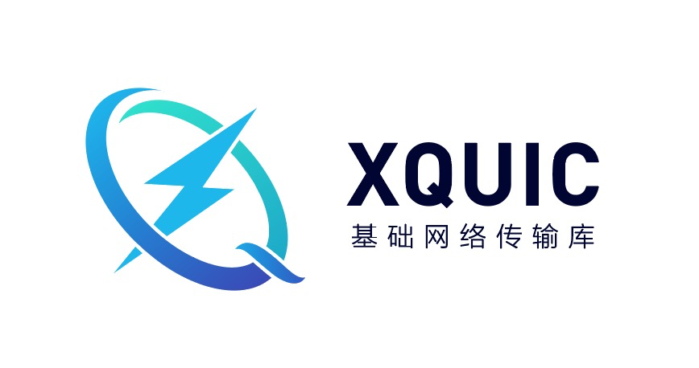

# XQUIC



[](https://github.com/alibaba/xquic/actions/workflows/build.yml)
[](https://github.com/alibaba/xquic/actions/workflows/codeql-analysis.yml)
[](https://www.codacy.com/gh/alibaba/xquic/dashboard?utm_source=github.com&amp;utm_medium=referral&amp;utm_content=alibaba/xquic&amp;utm_campaign=Badge_Grade)
[](https://www.codacy.com/gh/alibaba/xquic/dashboard?utm_source=github.com&utm_medium=referral&utm_content=alibaba/xquic&utm_campaign=Badge_Coverage)


> [简体中文文档 README-zh-CN](./docs/docs-zh/README-zh.md)

## Introduction

XQUIC Library released by Alibaba is …

… **a client and server implementation of QUIC and HTTP/3 as specified by the IETF.** Currently supported QUIC versions are v1 and draft-29.

… **OS and platform agnostic.** It currently supports Android, iOS, Linux, macOS and Windows. Most of the code is used in our own products, and has been tested at scale on android, iOS apps, as well as servers.

… **still in active development.** [Interoperability](https://interop.seemann.io/) is regularly tested with other QUIC implementations.

## Requirements

To build XQUIC, you need 
* CMake
* BoringSSL or BabaSSL

To run test cases, you need
* libevent
* CUnit

## QuickStart Guide

XQUIC supports both BabaSSL and BoringSSL.

### Build with BoringSSL

```bash
# get XQUIC source code
git clone git@github.com:alibaba/xquic.git
cd xquic

# get and build BoringSSL
git clone git@github.com:google/boringssl.git ./third_party/boringssl
cd ./third_party/boringssl
mkdir -p build && cd build
cmake -DBUILD_SHARED_LIBS=0 -DCMAKE_C_FLAGS="-fPIC" -DCMAKE_CXX_FLAGS="-fPIC" ..
make ssl crypto
cd ..
SSL_TYPE_STR="boringssl"
SSL_PATH_STR="${PWD}"
SSL_INC_PATH_STR="${PWD}/include"
SSL_LIB_PATH_STR="${PWD}/build/ssl/libssl.a;${PWD}/build/crypto/libcrypto.a"
cd ../..

# build XQUIC with BoringSSL
git submodule update --init --recursive
mkdir -p build; cd build
cmake -DGCOV=on -DCMAKE_BUILD_TYPE=Debug -DXQC_ENABLE_TESTING=1 -DXQC_SUPPORT_SENDMMSG_BUILD=1 -DXQC_ENABLE_EVENT_LOG=1 -DXQC_ENABLE_BBR2=1 -DXQC_DISABLE_RENO=0 -DSSL_TYPE=${SSL_TYPE_STR} -DSSL_PATH=${SSL_PATH_STR} -DSSL_INC_PATH=${SSL_INC_PATH_STR} -DSSL_LIB_PATH=${SSL_LIB_PATH_STR} ..
make -j
```

### Build with BabaSSL

```bash
# get XQUIC source code
git clone git@github.com:alibaba/xquic.git
cd xquic

# get and build BabaSSL
git clone git@github.com:BabaSSL/BabaSSL.git ./third_party/babassl
cd ./third_party/babassl/
./config --prefix=/usr/local/babassl
make -j
SSL_TYPE_STR="babassl"
SSL_PATH_STR="${PWD}"
SSL_INC_PATH_STR="${PWD}/include"
SSL_LIB_PATH_STR="${PWD}/libssl.a;${PWD}/libcrypto.a"
cd -

# build XQUIC with BabaSSL
git submodule update --init --recursive
mkdir -p build; cd build
cmake -DGCOV=on -DCMAKE_BUILD_TYPE=Debug -DXQC_ENABLE_TESTING=1 -DXQC_SUPPORT_SENDMMSG_BUILD=1 -DXQC_ENABLE_EVENT_LOG=1 -DXQC_ENABLE_BBR2=1 -DXQC_DISABLE_RENO=0 -DSSL_TYPE=${SSL_TYPE_STR} -DSSL_PATH=${SSL_PATH_STR} -DSSL_INC_PATH=${SSL_INC_PATH_STR} -DSSL_LIB_PATH=${SSL_LIB_PATH_STR} ..
make -j
```

### Run testcases

```bash
sh ../scripts/xquic_test.sh
```

## Documentation

* For using the API, see the [API docs](./docs/API.md).
* For platform support details, see the [Platforms docs](./docs/Platforms.md).
* For Chinese Simplified (zh-CN) translation of the IETF QUIC Protocol, see the Translation docs.
    - [RFC8999-invariants-zh](./docs/translation/rfc8999-invariants-zh.md)
    - [RFC9000-transport-zh](./docs/translation/rfc9000-transport-zh.md)
    - [RFC9001-tls-zh](./docs/translation/rfc9001-tls-zh.md)
    - [RFC9002-recovery-zh](./docs/translation/rfc9002-recovery-zh.md)
    - [draft-ietf-quic-http-34-zh](./docs/translation/draft-ietf-quic-http-34-zh.md)
    - [draft-ietf-quic-qpack-21-zh](./docs/translation/draft-ietf-quic-qpack-21-zh.md)
    - [RFC9221-datagram-zh](./docs/translation/rfc9221-datagram-zh.md)

* For using event_log module, see the [Event_log module docs](./docs/docs-zh/Event_log-zh.md)
* For testing the library, see the [Testing docs](./docs/docs-zh/Testing-zh.md).
* For other frequently asked questions, see the [FAQs](./docs/docs-zh/FAQ-zh.md) and [Trouble Shooting Guide](./docs/docs-zh/Troubleshooting-zh.md).

## Contributing

We would love for you to contribute to XQUIC and help make it even better than it is today! All types of contributions are encouraged and valued. Thanks to [all contributors](https://github.com/alibaba/xquic/blob/main/CONTRIBUTING.md#all-contributors). See our [Contributing Guidelines](./CONTRIBUTING.md) for more information.

If you have any questions, please feel free to open a new Discussion topic in our [discussion forums](https://github.com/alibaba/xquic/discussions).

## License

XQUIC is released under the Apache 2.0 License.

## Contact Us

Feel free to contact us in the following ways:

* e-mail: xquic@alibaba-inc.com
* Dingtalk group: 34059705
* slack channel: #xquic in quicdev group

  
